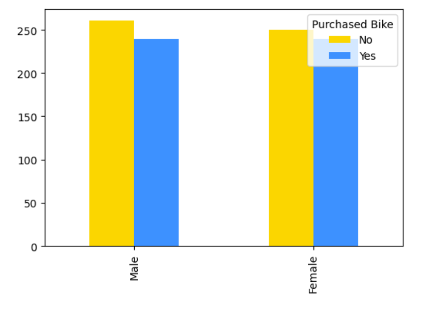
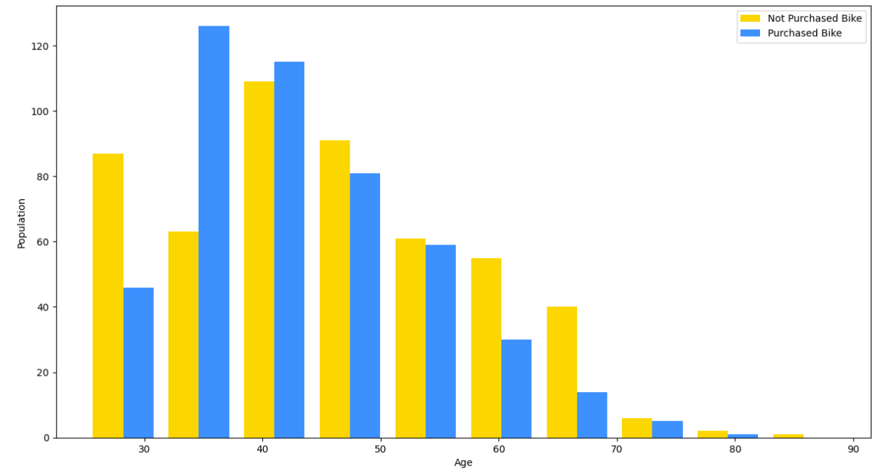
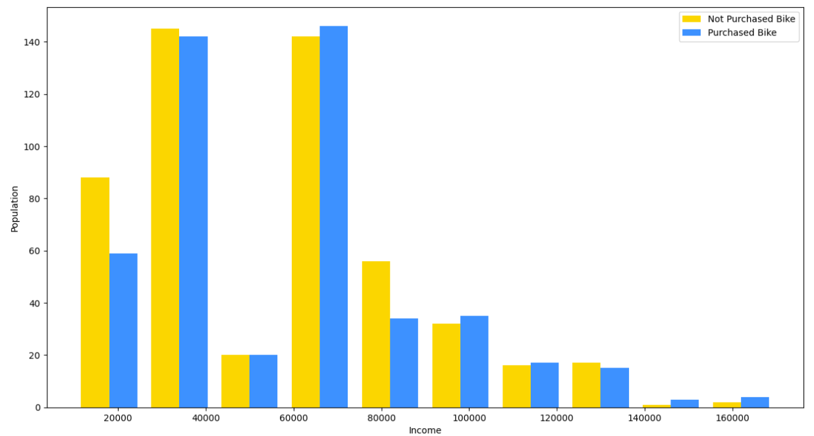
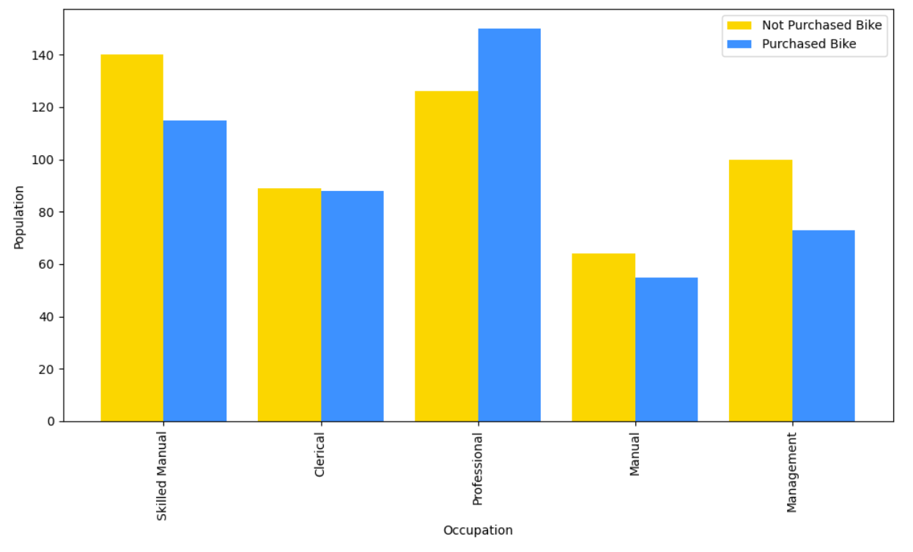
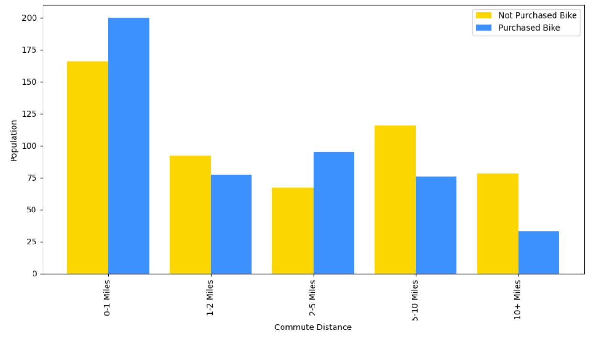
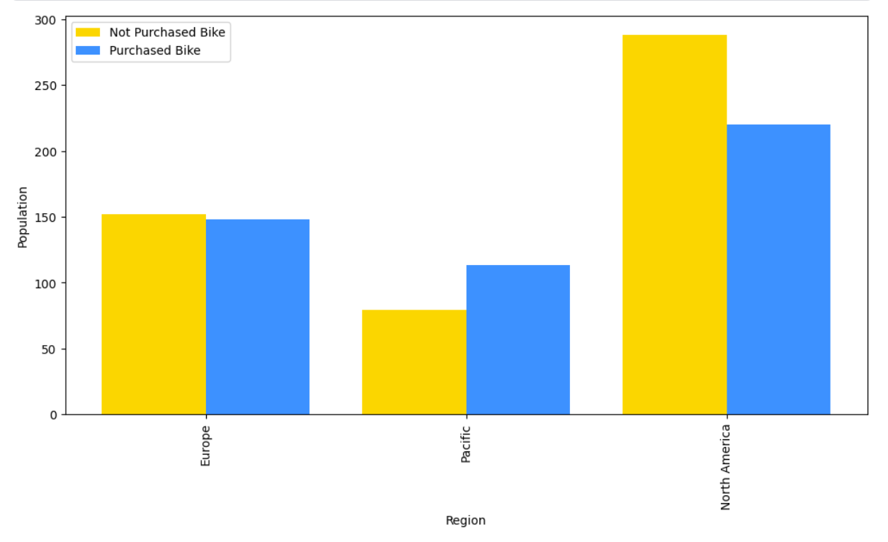
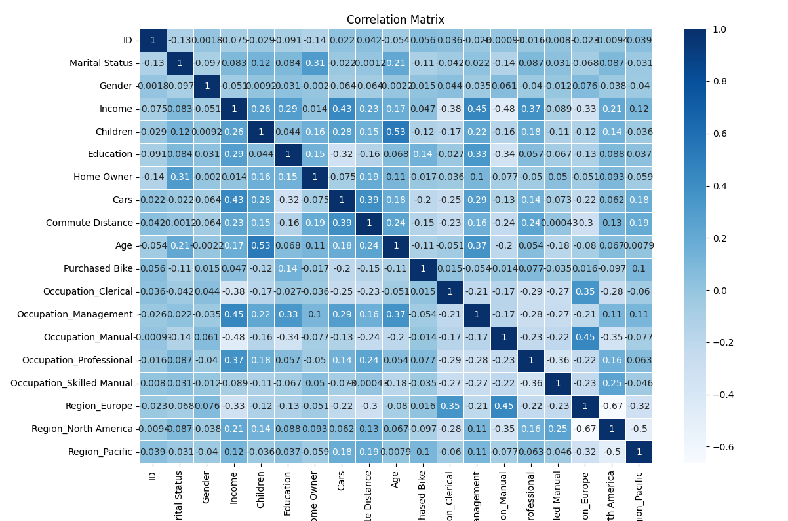
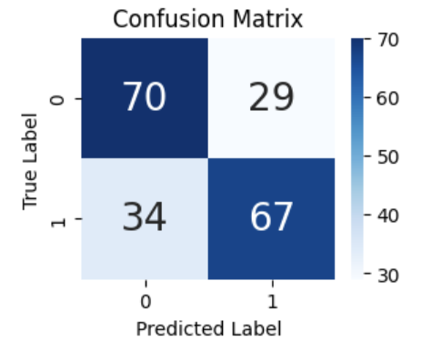

# Bike Buyers XGBClassifier

### DataSet From [Kaggle - Bike Buyers](https://www.kaggle.com/datasets/heeraldedhia/bike-buyers)

## Overview

- Language: Python v3.9.15
- Package: xgboost
- Model: XGBClassifier

## Data Distribution

<table>
  <tr>
    <td></td>
    <td></td>
    <td></td>
  </tr>
  <tr>
    <td></td>
    <td></td>
    <td></td>
  </tr>
</table>

## Correlation Matrix

## Confusion Matrix - Accuracy Rate 68.5%

